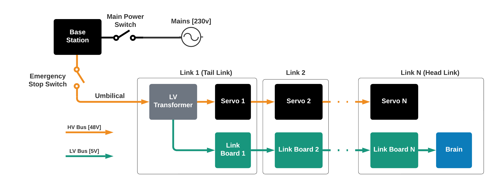

# Power Electronics 

Being a robot, the Boa needs electrical power. A lot of electrical power. The servos used on the Boa snake robot are quite power hungry and need a lot of juice when they run on max torque. 

The power supply chain of the Boa snake robot starts with a regular 230V mains socket. The Base Station of the Boa is powered by the mains socket, which in turns powers a huge 48V DC Switch-mode power supply, capable of delivering 21A of current at 48V. The Mains can be switched on an off using the _Main Power Switch_. The 48V power is transported to the Boa snake robot through the _Umbilical_. The 48V bus can be cut using the big red _Emergency Stop Switch_ on the _Base Station_

The _Umbilical_ is a flexible, durable 2-core 1,5mm² cable designed to transport power to moving parts in industrial systems. The outer PVC jacket of the cable is flexible and the conductors themselves have a high strand count, making them flexible while preventing breakage and failure from repeated bending. The _Umbilical_ is terminated in each end with a Neutrik 3-pin XLR connector.

 The umbilical is quite stiff. This could become an issue when doing experiments, as the stiffness of the cable might change the dynamics of the robot. Keep this in mind when designing experiments in the future.

_Fun side note: The XLR connector is very common within the stage tech industy. In general, you will see a lot of solutions on the Boa snake robot inspired by stage tech, as thats where i have most of my hands-on tech background apart from NTNU, of course. The XLR is usually used to transport sound signals on mV levels of voltage an mA levels of current. However, the connector was designed to handle waaaaay more power than that. The ruggedness of the connector, and its high current rating makes it ideal for a snake robot power bus. On a completely unrelated subject: The ruggedness and high current capacity of the XLR connector has made it the de-facto standard for attaching vibrating dildos to sex machines, and as a charger for electrical bikes. Small world huh?_

In the _Tail Link_ of the robot, you'll find the _LV transformer_. This little PCB transforms parts the 48V DC power into 5V DC power. The remainder of the 48V DC power is used to power the servo motors, while the 5V DC power is used to power sensors and control electronics. There are several reasons for the separation of the power busses:

1. By separating the LV from the HV power bus, we can disregard what voltages the control electronics need when picking a supply voltage for the servos. The servos support a range of voltages form 12V up to 48V. A higher voltage means less current for the same amount of power, which again reduces the required cross-section of the power bus conductors. Narrower conductors gives more flexible wires, which means less disturbance from wires bending when measuring joint torques and constraint forces.
2. The servos might produce rapid transients and voltage spikes on the HV power bus. By having an isolated LV power bus, these transients will affect the sensitive electronics in the sensor systems as little as possible.

Both the LV and HV power bus run the entire length of the robot, powering each link in turn, all the way up to the _Head Link_. The HV power bus is terminated in the servo in the last joint of the robot, while the LV bus enters the _head link_ to power the _Brain_ and LIDAR. The wires that transport the power busses along the length of the robot are, in the same fashion as the _Umbilical_, designed to be as flexible as possible.

While not drawn in the diagram, the ground conductor (or negative if you will) of the LV and HV power bus are connected with a capacitance in each link. This capacitance is intended to absorb any fast and transient changes in the ground potential in the LV and HV bus. This is mostly to ensure that the common-mode voltage on the RS485 bus that connects the _Link Boards_ to the servos doesn't spike and cause damage or data corruption in servo communications. Is this necessary? Perhaps not, but better safe than sorry...