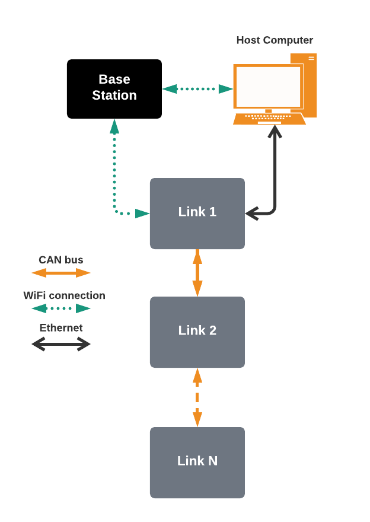

# Communications

In order to operate the Boa snake robot, it is necessary to transport sensor measurements from the links and transport
control commands to the links. This section explains the communications infrastructure. 

## Spine Bus
Each link is connected to a central CAN bus running along the entire length of the Boa snake robot. This bus, called the Spine Bus
serves as the communication medium between links, and between the links and the brain. The CAN bus runs at the maximum clock rate of 1MHz
allowed by the CAN bus standard. All units connected to the Spine Bus (both the Feather M4 CAN and the Raspberry Pi CAN hat) support a newer
version of the CAN protocol called CAN-FD. It should be possible to upgrade the firmware in the Boa to operate with CAN-FD increasing the
maximum clock rate to 8MHz. Due to the topology of a CAN bus, all the links as well as the brain can send targeted 
messages or broadcast messages onto the Spine Bus. 

The protocol used to communicate on the Spine Bus is documented in the [Spine Protocol](05_spine_protocol)

The Spine Bus is primarily used for the following type of data:

- Error messages: Messages to signal errors, warnings or faults somewhere in the robot. Usually followed by a panic message
- Panic messages: Messages signaling that all links should immediately halt all movement to prevent damage to the robot. Typically used when the robot is experiencing an unusually high measurement from one of the link sensors.
- Sync messages: Used to synchronize control input and sensor data
- Control messages: Tells the links to actuate their servos in different ways
- Sensor messages: Messages containing sensor data from the links

## Host computer communications
The Brain in the Head Link can communicate with a host computer in two different ways

The Base Station for the Boa snake robot contains its own local wireless network. As soon as a Boa robot powers up, the brain will attempt to wirelessly connect to the base station. By connecting the Host Computer to the same local network, one can connect to, and control, the Boa snake robot. Multiple Boa robots can be connected to the same base station, and can be controlled from the same host computer.

Alternatively: The Head Link has an exposed ethernet port, which can be used to connect directly to the host computer without having to go through the base station and the wireless connection. This might be useful in cases where it is necessary to run control algorithms that require more processing power than what is available in the Brain, and the latency incurred by the wireless connection is too large.