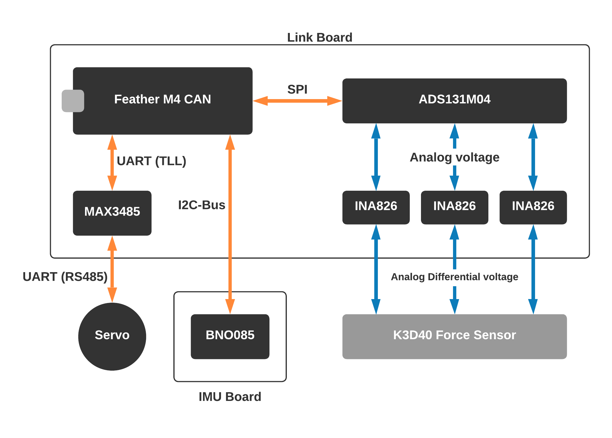

# Link on-board Electronics

This section specifically covers the electronics onboard each link in the Boa snake robot. 

## Microcontroller Board
The electronics are centered around the _Microcontroller Board_ which in our case is an Adafruit Feather M4 CAN. The _Microcontroller Board_ coordinates the control of the servo, transmissions over the CAN bus and reception and processing of sensor signals. The M4 CAN was chosen for this robot for 2 main reasons:

1. The board features a powerful ATSAME51J19 microcontroller using an ARM Cortex-M4 core running at 120MHz. The blazing clock speed allows the M4 CAN, combined with the hardware floating point support of the Cortex-M4 architecture, allows the M4 CAN to do some serious processing. The M4 CAN would have sufficient processing power to run real-time filtering algorithms or control loops.
2. The board has built-in support for CAN bus, including on-board voltage transceivers and ready-made firmware libraries 

All electronics connected to the _Link Board_, except for the servo is powered by 3.3V delivered by the M4 CAN which contains a 5V to 3.3V regulator. This means that the control electronics of a Boa snake robot link can be powered either from the _LV power bus_ or from the USB-C connector of the M4 CAN. 

The M4 CAN communicates with the other subsystems in the link using UART, I2C and SPI protocols.

The _Microcontroller Board_ is seated on the _Link Board_.

## Link Board
The Link Board is a custom built PCB which encompasses a couple of features

- The _Link Board_ features connectors that attach to the LV power bus, IMU board, K3D40 Force Sensor and Servo 
- The amplifier circuitry for the K3D40 Force Sensor is located on the _Link Board_.
- The _Link Board_ contains an RS485 voltage level transceiver, which allows the _Microcontroller board_ to use a hardware UART to communicate with the servo.  

The _Link Board_ has a single M3 mounting hole used to secure the board to the _PCB Holder_